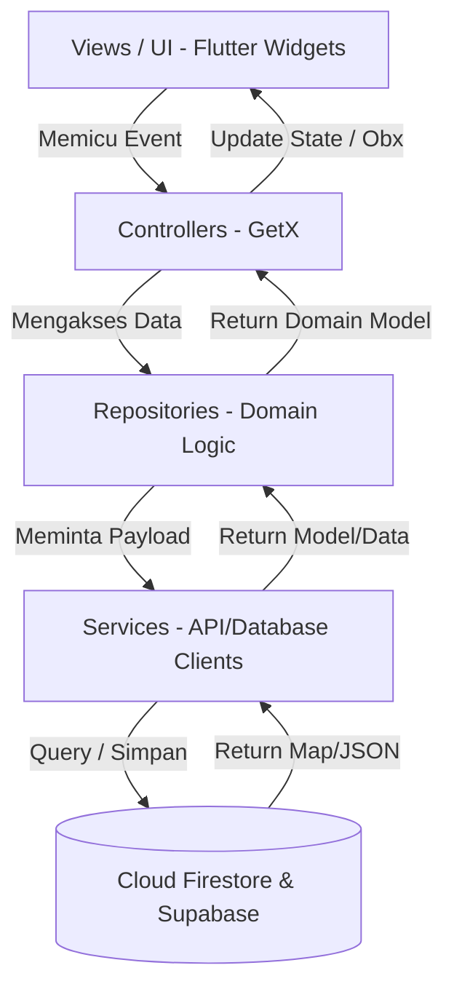

# TixCycle

[](https://flutter.dev)
[](https://dart.dev)
[](https://firebase.google.com)
[](https://supabase.com)
[](https://pub.dev/packages/get)

**TixCycle** adalah aplikasi mobile inovatif yang menggabungkan kemudahan pemesanan tiket konser dengan partisipasi aktif dalam kelestarian lingkungan melalui daur ulang sampah. Dengan konsep *green-ticketing*, pengguna dapat mengumpulkan koin/poin dari aktivitas pembuangan sampah pada tempat sampah pintar (simulasi IoT) dan menukarkannya dengan voucher diskon tiket konser atau berbagai penawaran menarik dari merchant mitra.

---

## 👥 Tim Development

- **Reza Rasendriya Adi Putra**
- **Ikhsan Fillah Hidayat**
- **Waladi Lintang Novianto**

---

## 🌟 Fitur Utama & Peran Pengguna

Aplikasi ini mendukung tiga peran pengguna utama dengan alur kerja yang terintegrasi:

### 1. Mode Pengguna (User / Greenies)
* **Autentikasi & Profil**: Registrasi, login (termasuk *Google Sign-in*), pembaruan data diri lengkap, serta pengunggahan foto profil langsung ke *Supabase Storage*.
* **E-Ticketing**: Menjelajahi konser terpopuler (*Featured*) melalui slider karosel, melakukan pencarian konser berdasarkan nama/lokasi, detail deskripsi konser, memilih kategori tiket, dan melakukan pemesanan.
* **Metode Pembayaran Virtual**: Simulasi pembayaran tiket dengan metode Transfer Bank (BCA, Mandiri, BRI Virtual Account), E-Wallet (DANA, OVO/Gopay, ShopeePay, LinkAja), hingga minimarket (Indomaret, Alfamart).
* **Tiket Saya & QR Code**: Tiket yang berhasil dibeli akan terdaftar pada menu "Tiket Saya" dalam bentuk QR Code unik untuk validasi masuk konser.
* **Koin Hijau & Pemindaian Sampah**: Melakukan pemindaian QR Code pada tempat sampah pintar untuk mendeteksi jumlah sampah (seperti botol plastik) dan secara instan mendapatkan hadiah Koin Hijau.
* **Redeem Voucher**: Menggunakan Koin Hijau yang terkumpul untuk menukarkan kupon potongan harga tiket konser atau promo belanja merchant.

### 2. Mode Penyelenggara Event (Admin / Event Organizer)
* **Manajemen Konser (CRUD)**: Menambah konser baru (*Add Event*), melihat daftar konser (*Event List*), mengubah info konser (*Update Event*), dan menghapus konser (*Delete Event*).
* **Validasi Tiket Masuk**: Pemindaian langsung (*QR Scanner*) pada tiket fisik/digital pengunjung konser. Sistem akan mencocokkan kode tiket secara real-time dengan data transaksi Firestore untuk check-in.
* **Generator QR Sampah**: Simulasi tempat sampah pintar (IoT) dengan menghasilkan QR Code khusus yang berisi informasi payload sampah dan poin rewards.

### 3. Mode Merchant / Mitra Penukaran
* **Validasi Kupon (Voucher Scanner)**: Memindai QR Code voucher pengguna untuk memvalidasi tanggal kedaluwarsa, sisa kupon, dan merubah status kupon menjadi terpakai secara instan di database.

---

## 🏗️ Arsitektur & Teknologi

Proyek ini dibangun menggunakan pola **MVC (Model-View-Controller)** yang dikombinasikan dengan **Repository Pattern** untuk memastikan pemisahan tugas yang bersih (*separation of concerns*) dan kode yang mudah dipelihara (*maintainable*).



### Stack Teknologi Utama:
* **Framework**: Flutter SDK (v3.6.1 atau lebih tinggi) & Dart SDK.
* **State Management & DI**: [GetX](https://pub.dev/packages/get) untuk reactive state management (`Rx`), routing dinamis, dan *Dependency Injection* melalui `Bindings`.
* **Database NoSQL**: [Cloud Firestore](https://pub.dev/packages/cloud_firestore) untuk penyimpanan data dinamis real-time (user, event, tiket, voucher, transaksi).
* **Autentikasi**: [Firebase Auth](https://pub.dev/packages/firebase_auth) & [Google Sign In](https://pub.dev/packages/google_sign_in).
* **Penyimpanan Berkas**: [Supabase Storage](https://pub.dev/packages/supabase_flutter) untuk menyimpan berkas gambar seperti foto profil pengguna dan foto voucher.
* **Akses Perangkat Keras**:
  * [Geolocator](https://pub.dev/packages/geolocator) & [Geocoding](https://pub.dev/packages/geocoding) untuk deteksi lokasi pengguna.
  * [Mobile Scanner](https://pub.dev/packages/mobile_scanner) untuk memindai tiket masuk dan QR sampah.
  * [Image Picker](https://pub.dev/packages/image_picker) untuk mengambil foto profil dari galeri/kamera.

---

## 📁 Struktur Direktori Proyek

Struktur folder di dalam direktori `lib/` disusun secara modular sebagai berikut:

```
lib/
├── bindings/       # GetX Bindings untuk mendaftarkan Dependencies (Service, Repo, Controller) secara malas/permanen
├── controllers/    # Logika bisnis dan manajemen status UI (mengatur loading state, input validator, dll.)
├── models/         # Kelas representasi data dengan fungsi mapping json (fromJson/toJson)
├── repositories/   # Lapisan perantara untuk memanggil service data dan memformatnya menjadi objek Model
├── routes/         # Definisi rute navigasi aplikasi (AppRoutes & AppPages) serta parameter rute
├── services/       # Pembungkus (wrapper) API eksternal (FirestoreService, SupabaseStorageService, dll.)
├── views/          # Widget antarmuka pengguna (halaman penuh dan komponen widget kustom di folder widgets)
├── firebase_options.dart  # Konfigurasi platform Firebase yang dihasilkan oleh FlutterFire CLI
└── main.dart       # Titik masuk (entrypoint) utama aplikasi untuk inisialisasi modul dan tema
```

---

## 📊 Skema Database (Cloud Firestore)

Berikut adalah struktur koleksi utama pada Firestore yang digunakan dalam proyek ini:

### 1. Koleksi `users`
Menyimpan profil akun pengguna terdaftar.
* Dokumen ID: `uid` (Firebase Auth UID)
```json
{
  "id": "String",
  "username": "String",
  "email": "String",
  "displayName": "String",
  "coins": "Number (int)",
  "profileImageUrl": "String (URL Supabase Storage)",
  "timeCreated": "Timestamp",
  "province": "String?",
  "city": "String?",
  "birthOfDate": "Timestamp?",
  "phoneNumber": "String?",
  "occupation": "String?",
  "gender": "String?",
  "idType": "String?",
  "idNumber": "String?",
  "role": "String ('user' | 'admin')"
}
```
* **Koleksi Anak `coin_transactions`** (`users/{uid}/coin_transactions`):
  * `id`: "String"
  * `amount`: "Number (int)" (positif jika bertambah, negatif jika ditukar)
  * `type`: "String ('earn' | 'redeem')"
  * `description`: "String"
  * `created_at`: "Timestamp"
* **Koleksi Anak `my_vouchers`** (`users/{uid}/my_vouchers`):
  * `id`: "String"
  * `voucherId`: "String"
  * `code`: "String (Kode unik QR)"
  * `isUsed`: "Boolean"
  * `purchased_at`: "Timestamp"
  * `used_at`: "Timestamp?"
  * `name`: "String"
  * `description`: "String"
  * `imageUrl`: "String"

### 2. Koleksi `events`
Menyimpan informasi konser musik yang diselenggarakan.
* Dokumen ID: `eventId` (Auto-generated)
```json
{
  "id": "String",
  "name": "String",
  "description": "String",
  "location": "String",
  "city": "String",
  "date": "Timestamp",
  "imageUrl": "String",
  "isFeatured": "Boolean",
  "latitude": "Number (double)?",
  "longitude": "Number (double)?"
}
```
* **Koleksi Anak `tickets`** (`events/{eventId}/tickets`):
  * `id`: "String"
  * `categoryName`: "String (VIP / Festival / Executive)"
  * `price`: "Number (double)"
  * `stock`: "Number (int)"
  * `description`: "String"

### 3. Koleksi `vouchers`
Katalog voucher promosi yang dapat ditukarkan dengan Koin Hijau.
* Dokumen ID: `voucherId` (Auto-generated)
```json
{
  "id": "String",
  "name": "String",
  "description": "String",
  "cost": "Number (int) (Harga koin)",
  "stock": "Number (int)",
  "imageUrl": "String (URL Supabase Storage)",
  "category": "String ('Makanan' | 'Hiburan' | 'Tiket' | 'Lainnya')",
  "created_at": "Timestamp"
}
```

### 4. Koleksi `transactions`
Menyimpan transaksi pembelian tiket konser oleh pengguna.
* Dokumen ID: `transactionId` (Auto-generated)
```json
{
  "id": "String",
  "userId": "String",
  "eventId": "String",
  "eventName": "String",
  "totalAmount": "Number (double)",
  "paymentMethod": "String",
  "paymentStatus": "String ('PENDING' | 'PAID' | 'FAILED')",
  "createdAt": "Timestamp",
  "purchasedItems": [
    {
      "ticketId": "String",
      "categoryName": "String",
      "price": "Number (double)",
      "seatNumber": "String"
    }
  ]
}
```

### 5. Koleksi `purchased_tickets`
Menyimpan detail per tiket konser individu yang telah dibeli untuk validasi pintu masuk (*check-in*).
* Dokumen ID: `ticketId` (Sama dengan kode unik QR tiket)
```json
{
  "transactionId": "String",
  "eventId": "String",
  "userId": "String",
  "categoryName": "String",
  "price": "Number (double)",
  "seatNumber": "String",
  "isCheckedIn": "Boolean",
  "checkInTime": "Timestamp?",
  "createdAt": "Timestamp"
}
```

---

## ⚙️ Persyaratan Sistem & Variabel Lingkungan

### Prasyarat:
1. **Flutter SDK**: Versi `3.6.1` atau lebih tinggi.
2. **Dart SDK**: Versi pendukung Flutter.
3. **Android Studio / VS Code** lengkap dengan plugin Flutter & Dart.
4. **Git** terpasang di sistem.

### Variabel Lingkungan (`.env`):
Buatlah file `.env` di direktori akar proyek dengan konfigurasi kredensial proyek Supabase Anda:
```env
SUPABASE_URL=https://<alamat-proyek-anda>.supabase.co
SUPABASE_ANON_KEY=<kunci-anon-proyek-supabase-anda>
```

*(Catatan: Pastikan file `.env` telah ditambahkan di bagian aset pada `pubspec.yaml` agar termuat ke dalam aplikasi saat dijalankan).*

---

## 🚀 Panduan Instalasi & Penggunaan

### 1. Clone Repositori
```bash
git clone https://github.com/reza675/TixCycle.git
cd TixCycle
```

### 2. Konfigurasi Dependensi
Ambil semua dependensi pustaka yang terdaftar pada `pubspec.yaml`:
```bash
flutter pub get
```

### 3. Setup Firebase
Gunakan FlutterFire CLI untuk mengaitkan aplikasi dengan proyek Firebase Anda (opsi ini akan memperbarui file `lib/firebase_options.dart` secara otomatis):
```bash
flutterfire configure
```

### 4. Membuat File Kredensial (.env)
Salin berkas template lingkungan dan lengkapi nilai `SUPABASE_URL` dan `SUPABASE_ANON_KEY` sesuai konfigurasi Supabase Storage Anda.

### 5. Generate Ikon Launcher (Opsional)
Jika Anda mengganti ikon default aplikasi, jalankan perintah berikut untuk memperbarui ikon Android dan iOS secara otomatis:
```bash
flutter pub run flutter_launcher_icons
```

### 6. Menjalankan Aplikasi
Hubungkan perangkat Android/iOS fisik atau jalankan emulator, lalu eksekusi perintah:
```bash
flutter run
```

---

## 🤝 Kontribusi

1. Fork repositori ini.
2. Buat fitur cabang baru (`git checkout -b feature/FiturKeren`).
3. Commit kontribusi Anda (`git commit -m 'Menambahkan Fitur Keren Baru'`).
4. Unggah ke cabang tujuan (`git push origin feature/FiturKeren`).
5. Ajukan *Pull Request* baru untuk ditinjau.

---

## 📄 Lisensi

Proyek ini dilisensikan di bawah **MIT License**. Lihat berkas `LICENSE` untuk rincian selengkapnya.
